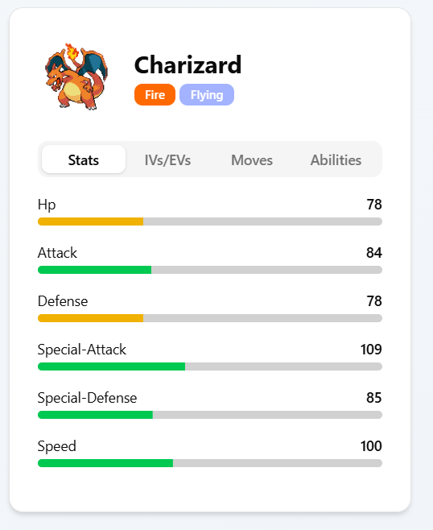

# 1. Einführung
## Vorstellung
Unser Entwicklungsteam besteht aus Paul und Erick, zwei Studenten des dualen Studiengangs, die beide bei ABB als Partner-Unternehmen tätig sind. Diese Konstellation bringt wertvolle Praxiserfahrung aus der Industrie in unser akademisches Projekt ein.

Erick ist im Bereich Home-Automation tätig und entwickelt intelligente Lösungen für moderne Wohnumgebungen. Seine Expertise umfasst IoT-Systeme, Benutzeroberflächen und die Integration verschiedener Technologien zu nahtlosen User Experiences. Diese Fähigkeiten sind besonders wertvoll für die Frontend-Entwicklung und die Gestaltung intuitiver Benutzerinteraktionen in unserem Projekt.

Paul arbeitet in einem spezialisierten Team, das MES-Lösungen (Manufacturing Execution Systems) entwickelt. In diesem Bereich beschäftigt er sich täglich mit komplexen Geschäftsprozessen, Datenintegration und der Entwicklung von Anwendungen, die kritische Produktionsabläufe steuern. Diese Erfahrung mit unternehmenskritischen Systemen und strikten Qualitätsanforderungen fließt direkt in die Architektur und Qualitätssicherung unseres Pokémon Arena-Projekts ein.

### Verbindung zu Pokémon

Unsere gemeinsame Leidenschaft für Pokémon wurzelt in unserer Kindheit, als wir beide die ersten Generationen der Spiele erlebt haben. Diese frühe Begeisterung für das strategische Gameplay und die Mechaniken des Pokémon-Universums motiviert uns, eine Anwendung zu entwickeln, die sowohl technisch anspruchsvoll als auch für die Community wertvoll ist.
Die Kombination aus professioneller Software-Entwicklungserfahrung bei ABB und persönlicher Begeisterung für das Pokémon-Franchise bildet die ideale Grundlage für ein Projekt, das sowohl die technischen Anforderungen unseres Software Engineering-Moduls erfüllt als auch echten Mehrwert für Pokémon-Enthusiasten schafft.

## Motivation
Die Entscheidung für ein Pokémon Arena-Projekt basiert auf einer durchdachten Analyse verschiedener Faktoren, die sowohl die technischen Lernziele unseres Software Engineering-Moduls als auch die praktische Relevanz einer solchen Anwendung berücksichtigen.

### Etabliertes Spielsystem mit bewährten Mechaniken
Pokémon ist eines der erfolgreichsten und langlebigsten Franchise der Videospielgeschichte mit über 25 Jahren kontinuierlicher Entwicklung. Die Spielmechaniken sind ausgereift, gut dokumentiert und bieten eine ideale Grundlage für ein Software-Projekt.

- **Komplexe, aber verständliche Regeln**: Das Kampfsystem kombiniert strategische Tiefe mit intuitiver Zugänglichkeit
- **Umfangreiche Datenbasis**: Über 1000 Pokémon mit jeweils individuellen Statistiken, Typen und Movesets
- **Klare Geschäftsregeln**: Eindeutige Validierungsregeln für Teams, Kämpfe und Pokémon-Konfigurationen

### Lebendige Competitive Scene und Community

Die Pokémon Competitive Community ist eine der aktivsten Gaming-Communities weltweit und demonstriert den realen Bedarf für spezialisierte Tools:
#### Turnierszene und Esports:

- **Offizielle Weltmeisterschaften**: Jährliche Pokémon World Championships mit Preisgeld über $500.000
- **Regional Tournaments**: Hunderte lokale und regionale Turniere weltweit
- **Online Ladders**: Plattformen wie Pokémon Showdown mit über 10 Millionen monatlichen Battles
- **Content Creation**: Tausende Streamer und YouTuber produzieren täglich strategische Inhalte
#### Strategische Komplexität:
Das Pokémon-Kampfsystem bietet überraschende strategische Tiefe mit Elementen wie:

- **Team Synergy**: Pokémon müssen sich gegenseitig ergänzen und Schwächen kompensieren
- **Meta-Game Evolution**: Strategien entwickeln sich kontinuierlich weiter basierend auf neuen Entdeckungen
- **Prediction und Mindgames**: Psychologische Aspekte des Wettkampfs
- **Resource Management**: Optimale Nutzung von HP, PP und Statusveränderungen

### Teambuilding als zentrale Herausforderung

Teambuilding ist der komplexeste und zeitaufwändigste Aspekt des competitive Pokémon-Spiels und bietet enormes Potenzial für Software-Unterstützung:
#### Aktuelle Herausforderungen für Spieler:

- **Overwhelming Choice**: Aus über 1000 Pokémon und tausenden Movesets optimale Teams zusammenstellen
- **Complex Calculations**: IV/EV-Optimierung, Schadenscalculations und Speed-Tiers manuell berechnen
- **Meta-Analysis**: Aktuelle Trends und Threats der Competitive Scene verfolgen
- **Testing und Iteration**: Teams gegen verschiedene Gegner testen und verfeinern

#### Unser Lösungsansatz:
Unsere Anwendung adressiert diese Pain Points durch:

- **Intuitive Team-Builder**: Intuitives Interface für schnelle Team-Erstellung
- **Automated Validation**: Sofortige Überprüfung auf legale Movesets und Regel-Compliance
- **Strategic Analysis**: Schwächen-Analyse und Verbesserungsvorschläge für Teams
- **Cloud Sync**: Teams geräteübergreifend verfügbar


## Dateien im Anhang
- **Diese Datei im originalen markdown Format**
- **User-Stories:** Als Jira Export (png), sowie als lesbare Markdown
- **Code:** Abzug des Codes (pdf), strukturiert nach CLEAN Schichten
- **ER-Diagramm:** Ein png des in draw.io erstellten Entity-Relation Diagramms
- **Clean-Diagramm:** Ein Diagramm zur Übersicht des Backends ähnlich zu einem Klassen-Diagramm

## PokeAPI

Die **PokeAPI** ist eine kostenlose und öffentlich zugängliche RESTful API, die umfassende Daten über das Pokémon-Universum bereitstellt. Sie fungiert als zentrale Datenquelle für alle Pokémon-bezogenen Informationen in unserem Projekt.

### Was stellt die PokeAPI zur Verfügung?

Die PokeAPI bietet uns Zugang zu einer Vielzahl von Pokémon-Daten, die für unser Kampfsystem essentiell sind:
- **Pokémon-Grunddaten**: Namen, IDs, Typen, Sprites (Bilder) in verschiedenen Varianten
- **Detaillierte Stats**: Basis-Stats wie HP, Angriff, Verteidigung, Spezialangriff, Spezialverteidigung und Initiative
- **Movesets**: Alle verfügbaren Attacken pro Pokémon mit Details wie Stärke, Genauigkeit, PP und Schadensklasse
- **Fähigkeiten**: Verschiedene Abilities, die Pokémon besitzen können, inklusive versteckter Fähigkeiten
- **Evolutionsketten**: Verwandlungsmöglichkeiten und Evolutionsbedingungen
- **Items**: Berries, TMs, Held Items und andere spielrelevante Gegenstände

Die API folgt REST-Prinzipien und liefert Daten im JSON-Format, was eine einfache Integration in moderne Webanwendungen ermöglicht. Besonders wertvoll ist die Konsistenz der Datenstruktur, die es uns erlaubt, robuste Parser und Mapping-Funktionen zu implementieren.

### Implementierung in unserem Projekt

Für die Integration nutzen wir die **PokeApiNet** NuGet-Library, die eine typisierte C#-Schnittstelle zur PokeAPI bereitstellt. Diese Library abstrahiert die HTTP-Anfragen und bietet uns stark typisierte Objekte für alle API-Endpunkte. Da wir eine lokale Instanz der PokeAPI verwenden, haben wir einen `CustomPokeApiClient` implementiert:

```csharp
public class CustomPokeApiClient : PokeApiClient
{
    public CustomPokeApiClient() : base(new HttpClient
    {
        BaseAddress = new Uri("http://localhost:8080/api/v2")
    })
    {
    }
}
```

Diese Implementierung ermöglicht es uns, während der Entwicklung unabhängig von der Internetverbindung zu arbeiten und gleichzeitig bessere Performance durch reduzierte Latenz zu erreichen. Der lokale Server wird über Docker bereitgestellt und enthält eine vollständige Kopie aller PokeAPI-Daten.

Unsere Query-Handler nutzen die PokeAPI intensiv, wie beispielsweise der `GetAllPokemonsQueryHandler`, der Pokémon-Listen mit Paginierung abruft, oder der `GetPokemonDetailsQueryHandler`, der detaillierte Informationen inklusive aller verfügbaren Moves parallel lädt, um die Performance zu optimieren.

### Warum haben wir uns für die PokeAPI entschieden?

1. **Vollständigkeit**: Enthält alle offiziellen Pokémon-Daten bis zur aktuellen Generation mit regelmäßigen Updates
2. **Standardisierung**: Konsistente Datenstruktur und bewährte API-Patterns, die industriellen Standards entsprechen
3. **Kostenlos**: Keine Lizenzgebühren oder API-Limits, was besonders für Bildungsprojekte wichtig ist
4. **Community-Support**: Aktive Entwicklergemeinschaft mit über 10.000 GitHub-Stars und gute Dokumentation
5. **Lokale Verfügbarkeit**: Möglichkeit einer lokalen Instanz für bessere Performance und Offline-Entwicklung
6. **Rechtssicherheit**: Offizielle Unterstützung durch The Pokémon Company für nicht-kommerzielle Projekte

Alternative Datenquellen wie Scraping von offiziellen Websites oder proprietäre APIs hätten rechtliche Risiken oder hohe Kosten bedeutet. Die PokeAPI bietet uns die perfekte Balance zwischen Datenqualität, Zugänglichkeit und rechtlicher Sicherheit.

# 2. Planung

## Github Versionskontrolle

Für die Versionskontrolle unseres Projekts setzen wir auf **GitHub**, das uns als zentrale Plattform für Code-Management und Kollaboration dient. GitHub hat sich als Industriestandard für Open-Source- und kommerzielle Projekte etabliert und bietet uns eine umfassende DevOps-Plattform.

**Unsere GitHub-Strategie umfasst:**
- **Zentrale Code-Verwaltung**: Alle Teammitglieder haben Zugriff auf den aktuellen Projektstand über ein einheitliches Repository
- **Branch-Management**: Feature-Branches für isolierte Entwicklung neuer Funktionalitäten, um Konflikte zu minimieren
- **Pull Request Workflow**: Systematische Code-Reviews vor dem Merge in den Hauptbranch zur Qualitätssicherung

Unser Branching-Modell orientiert sich an dem **Git Flow**-Pattern mit einem stabilen `main`-Branch, und Feature-Branches für einzelne User Stories. Dies ermöglicht uns parallele Entwicklung ohne Interferenzen und gewährleistet, dass der Hauptbranch immer deploymentfähig bleibt. Dies haben wir leider nicht immer zu 100% umgesetzt und sind deshalb auf mehr Probleme gestoßen als es bei ordentlicher Ausführung gegeben hätte.

## Jira User Stories

Für die strukturierte Planung und Verwaltung unseres Entwicklungsprojekts setzen wir auf Atlassian Jira in Kombination mit agilen Methodiken. User Stories bilden dabei das Herzstück unserer anforderungsbasierten Entwicklung und ermöglichen es uns, Features aus der Perspektive der Endbenutzer zu betrachten.

Die detaillierten User Stories unseres Pokémon Arena Projekts sind im Anhang als Export aus Jira beigefügt und zeigen die praktische Anwendung dieser Methodik in unserem konkreten Entwicklungskontext.

### User Stories als Grundlage agiler Entwicklung

User Stories folgen dem bewährten Format "Als [Rolle] möchte ich [Funktionalität], damit [Nutzen]" und dienen als leichtgewichtige Anforderungsdokumentation. Im Gegensatz zu traditionellen, umfangreichen Spezifikationsdokumenten fokussieren sich User Stories auf den Wert für den Benutzer und fördern die Kommunikation zwischen Entwicklungsteam und Stakeholdern.
Jede User Story in unserem Projekt enthält:

- Titel und Beschreibung: Klare, verständliche Formulierung der gewünschten Funktionalität
- Akzeptanzkriterien: Messbare Bedingungen für die Definition of Done
- Schätzungen: Absolute Aufwandsschätzung in Stunden
- Prioritäten: Geschäftswert und technische Abhängigkeiten bestimmen die Priorität

#### Jira als zentrale Planungsplattform

Jira Software bietet uns eine umfassende Toolchain für agiles Projektmanagement:
**Hierarchische Strukturierung**:

- Epics: Große Themenbereiche wie "Battle System" oder "User Management"
- Stories: Einzelne, implementierbare Features innerhalb der Epics
- Subtasks: Technische Arbeitsschritte zur Umsetzung der Stories
- Bugs: Defects mit Verlinkung zu den ursprünglichen Stories

# 3. Backend

## Datenbank

### ER-Diagramm und Datenbankdesign

Unsere Datenbank basiert auf einem relationalen Modell, das die komplexen Beziehungen zwischen Pokémon, Teams und Benutzern abbildet. Das Design folgt den Prinzipien der Normalisierung bis zur dritten Normalform, um Datenredundanz zu minimieren und Integrität zu gewährleisten.

**Zentrale Entitäten und ihre Beziehungen:**
- **TEAM_PRESET**: Speichert Team-Konfigurationen mit `Team_Preset_Id` (PK), `User_Id` (FK) und `Preset_Name`
- **Configured_Pokemon**: Enthält individuell konfigurierte Pokémon mit vollständigen Statistiken, IVs, EVs, Fähigkeiten und Referenz zum Team
- **Pokemon_Moves**: N:M-Beziehungstabelle zwischen konfigurierten Pokémon und ihren Attacken mit `Pokemon_Moves_id` (PK)
- **Preset_Pokemon_Ref**: Verknüpfungstabelle zwischen Teams und konfigurierten Pokémon für flexible Team-Zusammenstellungen


Das Datenbankschema berücksichtigt die Anforderungen von Pokémon-Daten, einschließlich der Tatsache, dass jedes Pokémon individuell konfigurierbar ist (IVs, EVs, Movesets). Foreign Key Constraints stellen sicher, dass referentielle Integrität gewährleistet ist

Die Konfiguration erfolgt über Entity Framework Databaseode-First Migrations, was uns ermöglicht, Datenbankänderungen versioniert und reproduzierbar zu verwalten. Besondere Aufmerksamkeit haben wir der Behandlung von NULL-Werten gewidmet, da Pokémon-Daten viele optionale Felder enthalten können.

### SQL Server als Datenbankmanagementsystem
Als Datenbankmanagementsystem nutzen wir **Microsoft SQL Server 2022**, der sich als robuste und skalierbare Lösung für unsere Anforderungen erwiesen hat:

**Technische Vorteile:**
- **ACID-Compliance**: Gewährleistung der Datenintegrität auch bei gleichzeitigen Transaktionen während Kämpfen
- **Advanced Security**: Row-Level Security für Benutzerdaten und Always Encrypted für sensitive Informationen
- **Integration**: Nahtlose Anbindung an das .NET-Ecosystem mit optimierten Datentypen und Funktionen
- **Skalierbarkeit**: Skalierung für wachsende Benutzerzahlen 

## C# .NET API

### Backend Architecture (Clean Architecture)
Unser Backend implementiert die **Clean Architecture** nach Robert C. Martin, die eine klare Trennung der Verantwortlichkeiten und hohe Testbarkeit gewährleistet. Diese Architektur ermöglicht es uns, Geschäftslogik von technischen Details zu entkoppeln und macht unser System wartbar und erweiterbar.

**Domain Layer (Innerste Schicht):**
Die Domain Layer enthält die reine Geschäftslogik ohne externe Abhängigkeiten:
- **Team Aggregate**: `Team.cs` mit Factory Methods für sichere Objekterstellung, `ConfiguredPokemon.cs` mit komplexer Validierungslogik, `Move.cs` für Attacken-Management
- **User Aggregate**: `User.cs` mit Team-Management-Funktionalitäten
- **Interfaces**: Definiert Contracts wie `TeamRequest`, `PokemonRequest` für typsichere Datenübertragung

**Application Layer (Anwendungslogik):**
Orchestriert Geschäftsprozesse und implementiert Use Cases:
- **Commands**: `CreateTeamCommand` mit zugehörigem `CreateTeamCommandHandler` für Write-Operationen
- **Queries**: `GetAllPokemonsQuery`, `GetPokemonDetailsQuery` für Read-Operationen nach CQRS-Pattern
- **Extensions**: `MappingExtensions` für effiziente DTO-Konvertierung

**Infrastructure Layer (Äußerste Schicht):**
Implementiert technische Details und externe Abhängigkeiten:
- **Persistence**: `AppDbContext` für Entity Framework mit optimierten Queries und Change Tracking
- **External APIs**: `CustomPokeApiClient` für PokeAPI-Integration mit Retry-Policies und Caching

**Presentation Layer (API-Schicht):**
Stellt HTTP-Endpunkte bereit und handhabt Request/Response-Zyklen:
- **Controllers**: `PokemonController`, `TeamController` mit RESTful Endpoints und Swagger-Dokumentation
- **Contracts**: DTOs wie `PokemonBasicResponse`, `TeamResponse` für optimierte Datenübertragung
- **Middleware**: Globale Error Handling, Logging und Authentifizierung

Die Dependency Inversion ermöglicht es uns, Abhängigkeiten durch Dependency Injection zu verwalten und macht unser System einfach testbar. Jede Schicht kann isoliert getestet werden, was zu einer hohen Code-Qualität führt.


### Entity Framework Core ORM
Wir verwenden **Entity Framework Core 7.0** als Object-Relational Mapper, der uns eine moderne und performante Datenzugriffsschicht bietet:

**Implementierungsdetails:**
- **DbContext**: `AppDbContext` verwaltet alle Entitäten
- **Migrations**: Durch den Databse-First approach wurden Migrations als Basis für die Entititäten verwendet
- **LINQ-Unterstützung**: Typsichere Datenbankabfragen mit Expression Trees für optimale SQL-Generierung

EF Core bietet uns erweiterte Features wie Lazy Loading für verwandte Entitäten, Global Query Filters für Soft Deletes und Shadow Properties für Audit-Felder, was uns maximale Kontrolle über das Mapping gibt:

```csharp
modelBuilder.Entity<ConfiguredPokemon>(entity =>
{
    entity.HasMany(p => p.Moves)
          .WithOne()
          .HasForeignKey(m => m.ConfiguredPokemonId);
    
    entity.Property(e => e.Name)
          .HasMaxLength(50)
          .IsRequired();
});
```

### ErrorOr für funktionale Fehlerbehandlung
Das **ErrorOr** Pattern verbessert unsere Fehlerbehandlung durch funktionale Programmierkonzepte und macht Fehler zu "First-Class Citizens" in unserem System:

```csharp
    public ErrorOr<Success> AddMove(ConfiguredMove move)
    {
        if (_moves.Count >= 4)
            return Error.Conflict(description: "A Pokémon cannot have more than 4 moves");
            
        if (_moves.Any(m => m.MoveId == move.MoveId))
            return Error.Conflict(description: "This move is already added to this Pokémon");
            
        _moves.Add(move);
        return Result.Success;
    }
```

**Kernvorteile des ErrorOr Patterns:**
- **Railway-Oriented Programming**: Explizite Erfolgs- und Fehlerbehandlung ohne Exception-Overhead
- **Typsicherheit**: Compiler-unterstützte Fehlerbehandlung
- **Komposition**: Verkettung von Operationen mit automatischer Fehler-Propagation
- **Lesbarkeit**: Klare Trennung zwischen Success Path und Error Handling
- **Performance**: Keine Exception-Kosten für erwartete Fehlerfälle

ErrorOr integriert sich nahtlos mit unserem MediatR-basierten CQRS-Pattern und ermöglicht konsistente Fehlerbehandlung über alle Anwendungsschichten hinweg.

## Unit Tests

### Umfassende Äquivalenzklassen-Analyse
Für unsere Unit Tests haben wir eine systematische Äquivalenzklassen-Analyse durchgeführt, die alle kritischen Geschäftsregeln und Edge Cases abdeckt:

| **Testbereich**           | **Gültige Klassen**                             | **Ungültige Klassen**                          |
| ------------------------- | ----------------------------------------------- | ---------------------------------------------- |
| **Team Creation**         | Name: 1-50 Zeichen, User ID > 0                 | Name: leer/null/51+ Zeichen, User ID ≤ 0       |
| **Pokemon Configuration** | IVs: 0-31, EVs: 0-252                           | HP: ≤ 0 oder ≥ 1000, Stats/IVs/EVs außerhalb   |
| **Move Validation**       | Move ID > 0, max. 4 Moves, legale Kombinationen | Move ID ≤ 0, > 4 Moves, illegale Kombinationen |
| **Team Size**             | 1-6 Pokémon, keine Duplikate                    | 0 oder > 6 Pokémon, identische Pokémon         |

Diese Klassifizierung berücksichtigt die komplexen Regeln des Pokémon-Universums und stellt sicher, dass unser System robust gegen alle möglichen Eingabeszenarien ist.

### XUnit Framework mit modernen Testing Patterns
Wir verwenden **XUnit 2.4** als primäres Test-Framework, ergänzt durch moderne Testing-Bibliotheken für maximale Effektivität:

**Kern-Features unserer Test-Suite:**
- **Fact/Theory Attributes**: Unterscheidung zwischen einfachen Tests und datengetriebenen Parametertests
- **Parallel Execution**: Bis zu 80% Zeitersparnis durch parallele Testausführung
- **Dependency Injection**: Nahtlose Integration mit .NET Core DI Container für realistische Tests
- **Custom Attributes**: Eigene Test-Kategorien für Integration-, Unit- und Performance-Tests

**Test-Organisation:**
```csharp
  [Theory]
  [InlineData(null)]
  [InlineData("")]
  [InlineData(" ")]
  [InlineData("\t")]
  [InlineData("\n")]
  public void CreateFromRequest_WithInvalidName_ShouldReturnValidationError(string invalidName)
  {
      // Arrange
      // Act
      // Assert
  }
```

### Fluent Assertions für ausdrucksstarke Tests
**Fluent Assertions 6.0** transformiert unsere Tests in selbstdokumentierenden Code mit natürlichsprachlichen Assertions:

**Assertion-Beispiel:**
```csharp
  // Assert
  result.IsError.Should().BeTrue();
  result.FirstError.Type.Should().Be(ErrorType.Validation);
  result.FirstError.Description.Should().Be("Pokemon name cannot be empty");
```

**Testabdeckung:**
Unser aktueller Test-Suite umfasst 50+ **Unit Tests** mit 95%+ Code Coverage der Domain Layer

Die Tests werden automatisch bei jedem Build ausgeführt.

## Integrationstest (Konzept)
Integrationstests spielen eine zentrale Rolle beim Übergang von isolierten Komponententests zu systemweiten Tests. Wenn die einzelnen Programmkomponenten getestet sind müssen sie zu einem System oder einem Teilsystem integriert werden. Zu diesem Integrationsprozess gehören die Systemerstellung und das Testen des entstandenen Systems auf Fehler die sich aus dem Zusammenwirken der Komponenten ergeben.

### Strategische Ansätze für Integrationstests
Für unser Pokémon Arena-Projekt wäre ein inkrementeller Ansatz besonders geeignet, der Elemente beider Strategien kombiniert:
#### Top-Down Ansatz für UI-Layer:

- Beginnt mit der Team-Builder Benutzeroberfläche
- Verwendet Stubs und Mocks während der frühen Entwicklung
- Ermöglicht frühe Demonstrations- und Validierungsmöglichkeiten

#### Bottom-Up Ansatz für Domain-Layer:

- Startet mit den Pokémon- und Team-Entitäten
- Aufbau zu Application Services und API-Controllern
- Besonders geeignet für die Integration der PokeAPI

### Regressionstestverfahren
Um das Finden von Fehlern zu erleichtern wird stets der inkrementelle Ansatz der Systemintegration und der Integrationstests verfolgt. Zu Anfang wird nur eine minimale Systemkonfiguration integriert und diese getestet. Dieser wird dann in kleinen Schritte jede weitere Komponente hinzugefügt und nach jedem dieser Schritte alles neu getestet.

Praktische Umsetzung:

Phase 1: Minimalsystem (Frontend)

- User Management + einfache Team-Erstellung
- Tests T1-T3: Benutzer registrieren, anmelden, einfaches Team erstellen (nur UI)

Phase 2: PokeAPI Integration

- Integration des PokeAPI-Clients
- Wiederholung T1-T3 + neue Tests T4: Pokémon-Daten abrufen

Phase 3: Team-Builder Logik

- Team-Speicherung und Validierung
- Alle vorherigen Tests + T5: Vollständige Team-Erstellung mit Speicherung in der Datenbank

### Schnittstellentests

Schnittstellentests finden statt wenn Module oder Teilsysteme zur Bildung größerer Systeme integriert werden, für unser Projekt sind besonders relevant:

#### Kritische Schnittstellen im Pokémon-System

PokeAPI-Integration

- Parameterschnittstelle: Pokémon-IDs, Move-IDs
- Potenzielle Fehler: Ungültige IDs, Rate Limiting

Database-Layer

- Prozedurschnittstellen: Entity Framework Operationen
- Potenzielle Fehler: Constraint Violations, Concurrency Issues

API-Controller

- Nachrichtenübergabe: HTTP Request/Response
- Potenzielle Fehler: Serialization, Validation
# 4. Frontend

## Allgemeiner Aufbau

Das gesamte Frontend unseres Pokémon-Battle-Simulators lässt sich in drei Teile unterteilen. Diese lauten:

- **Login Page**
- **Team Builder**
- **Battle Simulator**

Der Aufbau dieser Teile wurde in Form eines **TypeScript-React**-Projekts implementiert. **React** ist eine JavaScript/TypeScript-Programmbibliothek zur Erstellung von webbasierten Benutzeroberflächen.

Die Nutzung von **React** hat folgende Vorteile:

- **Komponentenbasierter Ansatz:** Die Benutzeroberfläche kann in wiederverwendbare Komponenten geschrieben werden, was die Entwicklung größerer Anwendungen erleichtert.
- **Virtuelles DOM:** Dies ermöglicht es React, Änderungen effizient umzusetzen, da nicht die gesamte Seite neu geladen wird, sondern nur die veränderte Komponente. Dieses Verhalten führt zu schnelleren Ladezeiten.
- **Unidirektionaler Datenfluss:** Daten fließen nur in eine Richtung, was den Datenfluss nachvollziehbarer und leichter debugbar macht.

## Frontend

Zusätzlich zu React wurde für eine effizientere Implementierung **Tailwind CSS** genutzt, um eine klare und gut strukturierte UI aufzusetzen. **Tailwind CSS** ist ein CSS-Framework, das es ermöglicht, CSS-Klassen direkt im HTML zu definieren. Dies führt zu übersichtlicherem Code und einer erhöhten Effizienz, da keine separaten CSS-Dateien mehr geschrieben werden müssen und alles somit in einer Datei liegt.

Das letzte Tool, das für die Entwicklung des Frontends genutzt wurde, ist die Library **shadcn/ui**.

**shadcn** ist eine Sammlung zugänglicher, wiederverwendbarer React-Komponenten, die man in sein React-Projekt kopiert und die auf Tailwind CSS basieren. Diese Komponenten beinhalten Kernaspekte jeder UI, wie zum Beispiel einen Button oder eine Progress-Bar. Der Vorteil von **shadcn** im Vergleich zu anderen UI-Libraries ist, dass der Code nicht nur installiert wird, sondern direkt in einen eigenen Ordner im React-Projekt eingefügt wird. Dies bedeutet für das UI-Development, dass diese Komponenten für den eigenen Use-Case anpassbar sind. Dies wurde auch in diesem Projekt genutzt, zum Beispiel durch die Progress-Bar, die so umgeschrieben wurde, dass der Balken selbst seine Farbe ändern kann.

**Aktivitätsdiagramm:**  


Dieses Diagramm beschreibt den allgemeinen Verlauf des Codes, der in diesem Projekt geschrieben wurde. Es zeigt die verschiedenen Schritte, die ein Benutzer durchläuft, um ein Team zu erstellen und einen Kampf zu simulieren. Im folgenden Abschnitt werde ich die einzelnen Blöcke des Diagramms näher erläutern.

## Login Page

Die Login Page ist die erste Seite dieses Projekts, die ein Nutzer sieht. Sie muss also eine kleine Zusammenfassung enthalten, was dieses Programm kann. Beim ersten Laden der Webseite dieses Projekts wird ein HTTP-GET-Request ausgeführt, der die benötigten Daten der Pokémon abruft. Im Rahmen dieses Projekts sind das alle Pokémon der ersten bis zur vierten Generation. Die Fertigstellung dieses Requests führt zum Rendern der Login Page, die die Funktionalitäten dieses Projekts kurz erklärt. Am unteren Rand der Seite sieht man folgenden Button:

<p align="center">
  
</p>

Mit dem Betätigen des Buttons öffnet sich eine Login Page, die durch **Clerk** erstellt wurde. **Clerk** ist eine Benutzerverwaltungsplattform für Webanwendungen. Sie bietet vorgefertigte UI-Komponenten, APIs und ein Admin-Dashboard für Webseiten, die ihre Dienste für die Authentifizierung und Benutzerverwaltung nutzen. In diesem Projekt wurde dies für den gesamten Login-Prozess eingesetzt.

<p align="center">
  
</p>

Zum Team Builder gelangt man nur durch ein erfolgreiches Einloggen, da ein User-Account benötigt wird, um spätere Teams in einer Datenbank zu speichern oder ein Team aus der Datenbank zu laden. Solange dies nicht geschieht, bleibt der Nutzer auf der Login Page.

### Team Builder

Mit einem erfolgreichen Login öffnet sich die Team-Builder-UI, die in vier Teile unterteilt werden kann. Der erste Teil ist die Benutzeroberfläche, mit der ein Nutzer auf sein Konto zugreifen und gegebenenfalls seine Daten ändern kann.

<p align="center">
  
</p>

Dieses Menü öffnet sich nur durch das Betätigen des Buttons oben rechts in der Ecke (im Bild blau markiert). Über dieses Menü ist es auch möglich, sich wieder abzumelden und zurück zur Login Page zu gelangen.

Die Daten, die vor dem Login abgerufen wurden, werden mit der Komponente `pokemon_card.tsx` dargestellt. Diese erstellt eine übersichtliche Card, mit der die grundlegenden Informationen wie Name, Typen sowie das Bild eines Pokémon angezeigt werden. Der Normalfall ist, dass alle Pokémon, die durch den HTTP-GET-Befehl abgerufen wurden, auch angezeigt werden. Der Nutzer kann jedoch durch eine Filterfunktion diese Auswahl eingrenzen, um nach bestimmten Pokémon oder Typen zu suchen. Dafür muss er nur das gesuchte Attribut in die Filterleiste eingeben.


Durch das Klicken auf eine der Pokémon-Cards wird ein weiterer HTTP-GET-Befehl ausgeführt, mit dem weitere Informationen für das angeklickte Pokémon abgerufen werden. Diese neuen Informationen werden dann in einem neuen Menü innerhalb mehrerer Tabs dargestellt.

<p align="center">
  
</p>

Diese Übersicht wird durch die Componente "pokemon-details" die in der gleichnamigen Datei definiert wird. Durch das Drücken der Tabs unter dem Bild des Pokemon wird die Ansicht gewechselt und andere Details der Pokemon angezeigt. Diese Details können dann nach Wünschen des Nutzers verändert werden zum Beispiel kann der Nutzer unter dem Tab "Moves" das Moveset was dieses Pokemon im Kampf haben wird anpassen.

Der Nutzer kann nun nach der Anpassung oder auch direkt durch Drücken auf das Plus bei der Pokémon-Card das Pokémon seinem Team hinzufügen. Wenn zu diesem Zeitpunkt das Pokémon, das dem Team hinzugefügt werden soll, nicht die spezifischen Dateien erhalten hat, werden sie ihm hinzugefügt. Das aktuelle Team des Nutzers ist die letzte Komponente, die der Team Builder anzeigt, in Form der **Team Preview**. In dieser Komponente wird das aktuelle Pokémon-Team des Nutzers dargestellt sowie die freien Slots, damit der Nutzer eine klare Übersicht hat. Pokémon können auch aus dem Team entfernt werden, indem der Button mit der Mülltonne betätigt wird. Die Buttons für das später implementierte Speichern und Laden von Teams befinden sich ebenfalls über dem Team Previewer.

<p align="center">
  
</p>

Unter dem Team Previewer befindet sich eine Progressbar, die sich füllt, je mehr Pokémon im Team sind. Sobald sich mindestens ein Pokémon im Team befindet, erhält der **Start Battle**-Button seine Farbe, was dem Nutzer ermöglicht, die Team-Builder-UI zu verlassen und zur **Battle Simulation UI** zu wechseln.

## Pokémon Battler

Diese UI wird nur geöffnet, wenn der Team Builder ein Pokémon-Team von mindestens einem Pokémon enthält, und startet sofort in einem Kampf mit einem zufälligen Gegner. Diese komplette UI wird durch die Funktion `pokemon-battle` aus der gleichnamigen Datei erstellt. Die Simulation startet für den Nutzer sowie den Gegner mit dem Pokémon an der ersten Stelle ihrer Teams. Diese werden dann auf das Kampffeld geschickt.

<p align="center">
  
</p>

Dies ist das Hauptmenü der Kampfsimulation. Die Pokébälle auf dem Bildschirm, rechts neben dem Untermenü und oben links im Bild, zeigen die aktuelle Anzahl der Pokémon der jeweiligen Teams an sowie deren Zustand. Ein Pokémon, das im Kampf besiegt wurde, also 0 HP hat, wird in dieser Anzeige ausgegraut dargestellt. Dies bietet dem Nutzer einen effizienten Überblick über den Zustand der jeweiligen Teams.

Für die aktuell kämpfenden Pokémon gibt es ebenfalls eine Übersicht der wichtigsten Informationen. Diese befindet sich rechts bzw. links neben dem Pokémon (für den Gegner). In dieser Übersicht werden der Name des aktuellen Pokémon, sein Level sowie sein Typ in Form von Badges angezeigt. Zusätzlich wird mit einer Progressbar dargestellt, wie viele Health Points (HP) das Pokémon aktuell von seinen maximalen HP übrig hat.

Die letzte Komponente im Hauptmenü ist ein Untermenü aus vier Buttons, die die möglichen Aktionen des Nutzers repräsentieren. Das Betätigen dieser Buttons führt zu einer Änderung des Battle States und somit auch des Menüs. Der Button **Items** führt im Rahmen dieses Projekts zu keiner Änderung, da keine Items implementiert wurden; der Button selbst wurde aus Symmetrie- und dekorativen Gründen erstellt. Die einzige Veränderung, die durch das Betätigen geschieht, ist, dass der Battle Text, der knapp über dem Untermenü angezeigt wird, die Nachricht *Your Bag is Empty* ausgibt.

Der Button **Run** soll dem Nutzer die Möglichkeit geben, aus einem Kampf frühzeitig auszusteigen, um zum Beispiel sein Team weiter zu optimieren. Um das Risiko eines versehentlichen Betätigens zu minimieren, wurde ein Run Confirmation-Menü eingefügt. Mit diesem wird der Nutzer um eine Bestätigung gebeten, ob er das Menü wirklich verlassen möchte. Wird diese Frage mit *Nein* beantwortet, kehrt die UI zum Hauptmenü des Kampfes zurück. Bei einer positiven Antwort wird dem Nutzer die Team-Builder-UI wieder angezeigt.

<p align="center">
  
</p>

Die Nutzung des Untermenüs **Pokémon** öffnet ein Menü, in dem alle Pokémon im Team des Nutzers angezeigt werden. Das Pokémon in diesem Wechselmenü wird mit einem Bild, seinem Namen und einer Progressbar, die seine aktuellen HP mit den maximalen vergleicht, dargestellt. Das aktuell kämpfende Pokémon des Nutzers wird grün hervorgehoben; das Betätigen löst hier keine Aktion aus. Beim Betätigen eines anderen Pokémon wird eine Wechselanimation abgespielt, das kämpfende Pokémon wird mit dem neu ausgewählten ausgetauscht und alle folgenden Aktionen werden mit dem neuen Pokémon durchgeführt, z. B. der Angriff des Gegners, der in der Regel nach dem Wechsel stattfindet. Zusätzlich enthält dieses Menü einen **Back**-Button, mit dem die Rückkehr zum Hauptmenü ermöglicht wird.

<p align="center">
  
</p>

Das letzte Untermenü, mit dem der Nutzer eine Aktion ausführen kann, ist **Attack**. Dieser Button öffnet ein Angriffsmenü mit allen Attacken im Moveset des Pokémon. Die Attacken enthalten weitere Details, die für den Kampf wichtig sind. Es werden die Stärke (Power) des gewählten Moves sowie sein Typ angezeigt. Zudem wird zwischen *physical* und *special* Attacken unterschieden, da die Schadenskalkulation mit unterschiedlichen Stats durchgeführt wird. Die letzte Anzeige für jede Attacke sind die **Power Points (PP)** – diese repräsentieren, wie häufig das aktuell kämpfende Pokémon diesen Angriff noch ausführen kann. Wenn dieser Wert 0 erreicht, ist die Attacke nicht mehr nutzbar.

<p align="center">
  
</p>

Durch das Betätigen eines dieser Buttons wird die Aktion des Spielers für diese Runde festgelegt. Nun wird geprüft, ob das Pokémon des Spielers oder das des Gegners schneller ist, also wer den höheren Speed-Stat besitzt. Basierend darauf greift zuerst der Spieler oder der Gegner an. Die Ausführung eines Angriffs verläuft immer identisch: Zuerst werden die Schadensparameter berechnet, die benötigt werden, um eine korrekte Schadenskalkulation durchzuführen – dazu gehört zum Beispiel der *Critical Hit*, also die 6,25 % Wahrscheinlichkeit, doppelten Schaden zu verursachen.

 Nach der Schadenskalkulation werden die Power Points der Attacke um eins reduziert und anschließend die HP des Verteidigers angepasst. Basierend darauf, wer zuerst angegriffen hat, wird danach die Aktion des anderen ausgeführt. Falls ein Angriff das verteidigende Pokémon besiegt, also dessen HP auf 0 setzt, wird geprüft, ob noch lebende Pokémon im Team sind. Falls nicht, ist der Kampf abgeschlossen und der Angreifer hat gewonnen. Der Nutzer kann dann per Knopfdruck zurück zum Team Builder wechseln.

<p align="center">
  
</p>

Gibt es noch lebende Pokémon nach dem Besiegen des verteidigenden, wird es – je nachdem, wessen Pokémon besiegt wurde – ausgewechselt. Wenn es ein Pokémon des Gegners war, wird zufällig eines der noch lebenden ausgewählt und eingewechselt. Bei einem besiegten Pokémon des Nutzers öffnet sich das Pokémon-Select-Menü (ohne **Back**-Button), um dem Spieler die Auswahl zu ermöglichen, welches Pokémon er als Nächstes einsetzen möchte.

Damit wäre eine vollständige Übersicht der Vorgehensweise und Logik der drei Unterteilungen gegeben, um das Verhalten des Frontends besser verstehen zu können.


# 6. Fazit und Ausblick
